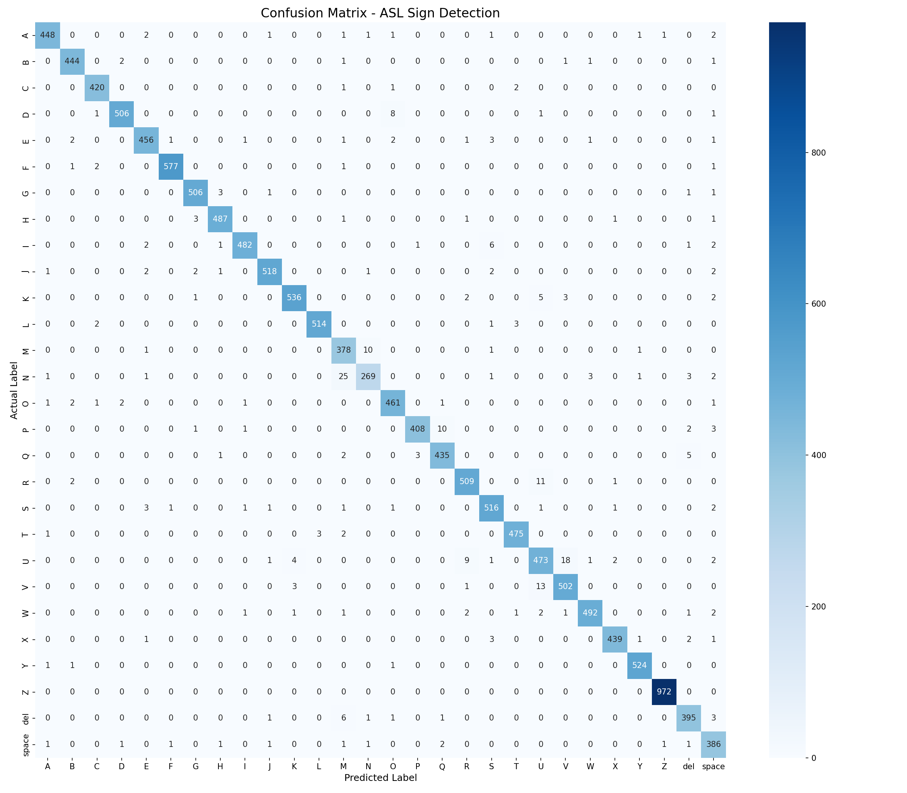

# ASL Sign Detection using MediaPipe and XGBoost


> 🏆 **Submitted to the [2030 AI Challenge](https://the-2030-ai-challenge.devpost.com/)** — Code for Change. Build the Future.  
> **UN SDG 10: Reduced Inequalities** · **SDG 3: Good Health and Well-being**  
> Live demo: [ Streamlit URL coming soon ]

---

## Overview
A real-time American Sign Language (ASL) alphabet detection system built using MediaPipe hand landmarks and XGBoost. Achieves **98.43% accuracy** across 28 classes (A-Z + space + del) without training on a single raw image.

## Motivation
Built as a proxy for Nigerian Sign Language (NSL) alphabet detection due to the lack of publicly available NSL datasets. ASL and NSL share similar fingerspelling patterns, making this a valid and practical starting point for building accessible communication tools for the Nigerian deaf community.

## Approach
Instead of training a CNN directly on raw images, this project:
1. Extracts 21 hand keypoints per image using MediaPipe (63 features: x, y, z per keypoint)
2. Normalizes landmarks relative to the wrist — making the model focus on hand shape, not size or position
3. Trains an XGBoost classifier on those normalized landmarks
4. Runs real-time inference via webcam

This approach is faster, more generalizable, and works across different skin tones and backgrounds compared to pixel-based CNNs.

## Model Progression

| Model | Accuracy |
|-------|----------|
| Random Forest (raw landmarks) | 97.64% |
| Random Forest (normalized landmarks) | 98.17% |
| XGBoost (normalized landmarks) | **98.43%** |

Each step was a deliberate improvement:
- **Normalization** — subtracts wrist position and scales by hand size, making the model skin-tone and scale agnostic
- **XGBoost** — builds trees sequentially, each learning from the mistakes of the previous one

## Pipeline
1. **Data Collection** — ASL Alphabet Dataset (87,000 images, 28 classes)
2. **Landmark Extraction** — MediaPipe HandLandmarker extracts 21 keypoints per image
3. **Normalization** — Wrist-centered, scale-invariant landmark normalization
4. **Training** — XGBoost classifier trained on 63 normalized landmark features
5. **Evaluation** — 98.43% accuracy on 20% held-out test set
6. **Inference** — Real-time webcam detection

## Results

- Accuracy: **98.43%**
- Macro Avg Precision: **0.97**
- Macro Avg Recall: **0.97**
- Macro Avg F1: **0.97**

### Confusion Matrix


### Notable Observations
- **Perfect accuracy**: Z (100% — unique hand shape)
- **Most confused**: M and N (visually similar in ASL — 3 vs 2 fingers over thumb)
- **Consistent performance**: 26/28 classes above 95% accuracy
- **Skin-tone agnostic**: Works on dark skin tones — confirmed via real-world webcam testing

## Dataset
- [ASL Alphabet Dataset - Kaggle](https://www.kaggle.com/datasets/grassknoted/asl-alphabet)
- 87,000 images across 28 classes (A-Z + space + del)
- 69,273 samples retained after MediaPipe landmark extraction
- ~24% failed detections due to awkward angles and lighting

## Tech Stack
- **MediaPipe 0.10.33** — Hand landmark extraction
- **XGBoost** — Classification
- **Scikit-learn** — Preprocessing and evaluation
- **OpenCV** — Real-time webcam inference
- **Pandas / NumPy** — Data manipulation
- **Matplotlib / Seaborn** — Visualization
- **Python 3.12** — Core language

## Project Structure
```
asl-sign-detection-mediapipe-rf/
├── asl_sign_detection.ipynb    # Main notebook
├── app.py                       # Real-time webcam detector
├── asl_model_xgb.json          # Trained XGBoost model
├── label_encoder.pkl            # Label encoder
├── confusion_matrix.png         # Model evaluation
├── requirements.txt             # Dependencies
├── .gitignore                   # Excludes large files
└── README.md                    # Project documentation
```

## Large Files
Due to GitHub file size limits, the following files are hosted on Google Drive:
- `landmarks_dataset.csv` (82MB) — extracted landmarks

## Limitations
- Trained on ASL dataset — not native Nigerian Sign Language (NSL)
- Letters with similar curled finger positions (M/N, A/X, E/S) remain challenging
- Performance drops in poor lighting conditions
- Dataset has limited diversity in number of contributors

## Future Work
- Collect native NSL dataset for fine-tuning
- Add joint angle features and relative distances for richer feature engineering
- Explore LSTM for dynamic signs
- Deploy as a mobile application
- Benchmark formally against CNN baseline.

## Medium Articles
- [Part 1 — Beginner Walkthrough](https://temiloluwaval.medium.com/i-replaced-87-000-images-with-63-numbers-heres-how-i-built-a-sign-language-detector-404f73b3c3aa)
- [Part 2 — Technical Deep Dive](https://temiloluwaval.medium.com/why-i-chose-63-numbers-over-millions-of-pixels-landmarks-vs-cnn-for-sign-detection-14e0f75a92f7)

## Author
**Temiloluwa Valentine**
- GitHub: [@Valentinetemi](https://github.com/Valentinetemi)
- Medium: [@temiloluwaval](https://temiloluwaval.medium.com)

## License
MIT License
